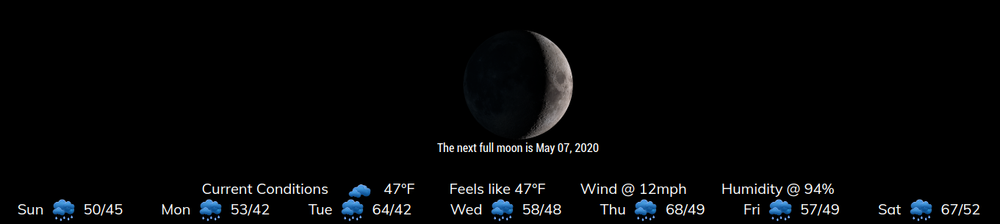
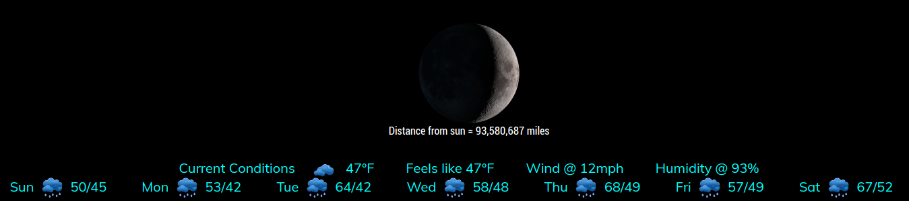
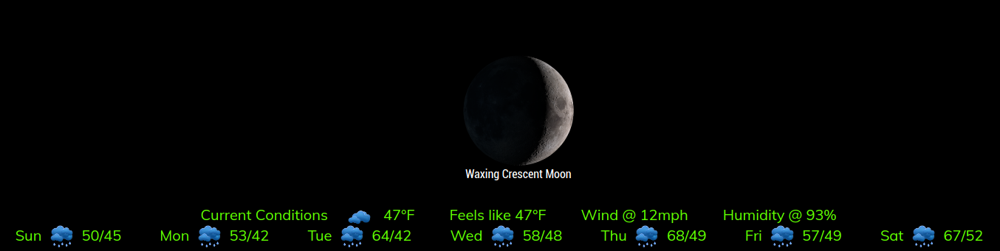

## MMM-BMW-CC

**Bugger My Weather**  

Now using version 4 of the free ClimaCell api.

You will need a new api key (as of 1/28.21) to use this updated module.

Version 3 has been deprecated by Climacell .

## Same church, different pew

* Due to Darksky discontinuing its free api I moved to ClimaCell
* The data is a bit different but you get 30000 calls a month!

## Good-bye bottom_bar (Well, not really)

* This was designed for use in the bottom_bar position of your MagicMirror
* Can share bottom bar position with any module via Hello_Lucy
* Minutely updates for current conditions
* CSS provided for coloring and sizing. Make it your own.

## Examples

* Default white



* Colored






## Installation and requirements

* `git clone https://github.com/mykle1/MMM-BMW-CC` into the `~/MagicMirror/modules` directory.

* Free API key at `https://www.climacell.co/weather-api/pricing/` (Required)

* No dependencies needed! No kidding!

## Config.js entry and options

```
{
    disabled: false,
    module: "MMM-BMW-CC",
    position: "bottom_bar", // designed for bottom_bar(best) thirds should be good too
    config: {
        apiKey: "Your FREE api key", // Get at https://www.climacell.co/weather-api/pricing/
        ownTitle: "Current Conditions",
        tempUnits: "imperial", // imperial or metric
        lat: '43.574794', // Your latitude
        lon: '-77.112454', // Your longitude
        css: "2", // 1-6
        playSounds: "no", // Temporarily disabled!!!
        useHeader: false, // true if you want a header
        header: "Your header",
        maxWidth: "100%",
        updateInterval: 5 * 60 * 1000,
    }
},
```

## Thanks to @cowboysdude for perpetual tech support!

* The original MMM-BMW is still available. However, it requires an older WunderGround API key

* MMM-BMW-DS still works if you have a Darksky api key (These will expire eventually)

* Remember, you need a new API key. V3 keys will not work. Re-register at Climacell for new key

## Language support is not supported by the new api
